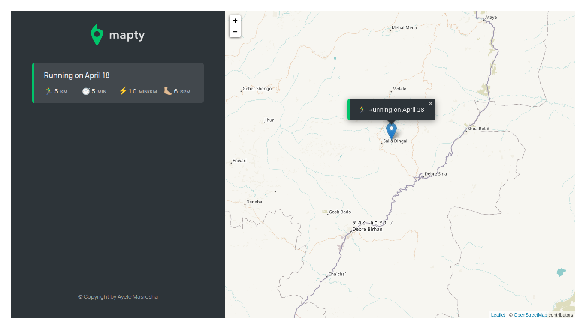

## Mapty
  
This simple javascript project is based on jonahtan schemedmatan udemy course.  
Within this simple project main javascript concepts are covered.  
This project simply log workouts within map and localstorage.  

